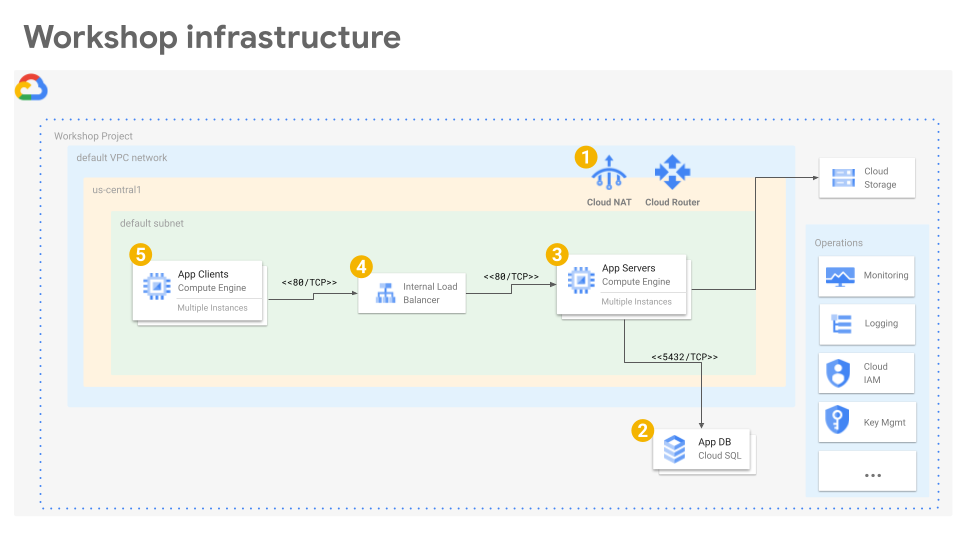

# Workshop - Application Pool

What if you have a legacy application that you want to run in Google Cloud,
and you still want to take advantage of as much of the automation and intelligent
application management as possible?

What if your application _also_ has some pretty heinous constraints such as:

- It can't be containerized for legal/policy reasons
- It requires about a day turnaround time to provision license entitlements for each instance created

This is the problem we'll work to solve in this workshop.

**Note**: If you arrived at this repo from a random search please STOP reading
now. Unless you are working with the very specific constraints listed above, I
strongly recommend that you instead use tools such as
[Kubernetes](https://cloud.google.com/kubernetes-engine) to manage modern
applications on Google Cloud.

**Note**: This repo contains snippets we'll used to learn and experiment and
work to solve a very specific problem. Nothing here is production-ready and
should not be used for any production applications.

**Note**: This is WIP and isn't completely working yet.

## Costs

If you run the example commands below, you will use billable components of
Google Cloud Platform, including:

- Compute Engine
- Cloud SQL

You can use the
[Pricing Calculator](https://cloud.google.com/products/calculator)
to generate a cost estimate based on your projected usage.

## Before you begin

Start by opening
[https://console.cloud.google.com/](https://console.cloud.google.com/)
in a browser.

Create a new GCP Project using the
[Cloud Resource Manager](https://console.cloud.google.com/cloud-resource-manager).
The project you create is just for this example, so you'll delete it below
when you're done.

You will need to
[enable billing](https://support.google.com/cloud/answer/6293499#enable-billing)
for this project.

You will also need to enable the Compute Engine (GCE) service for this account

[Enable Example Services](https://console.cloud.google.com/flows/enableapi?apiid=compute.googleapis.com,sql-component.googleapis.com,sqladmin.googleapis.com,cloudresourcemanager.googleapis.com)
    
Next, make sure the project you just created is selected in the top of the
Cloud Console.

Then open a Cloud Shell associated with the project you just created

[Launch Cloud Shell](https://console.cloud.google.com/?cloudshell=true)

It's important that the current Cloud Shell project is the one you just
created.  Verify that

    echo $GOOGLE_CLOUD_PROJECT

shows that new project.

All example commands below run from this Cloud Shell.

## Workshop source

Get the source

    git clone https://github.com/mmm/gce-application-pool
    cd gce-application-pool

All example commands below are relative to this top-level directory of the
examples repo.

## Tools

We use [Terraform](terraform.io) for these examples and the latest version is
already installed in your GCP Cloudshell.

## Workshop infrastructure

### Set up some basic networking requirements

A couple of network dependencies:

    cd terraform/network
    terraform init
    terraform plan
    terraform apply

This creates a NAT gateway and router so we can use nothing but internal
addresses across the board.  We also reserve in internal static address that
we'll later attach to the head of our internal load balancer (ILB).  We do this
here so we can bounce subsequent infrastructure up and down during development
without having to change test client config.

### Create a Cloud SQL database for the application to use

Create a Cloud SQL managed Postgresql-12 database instance.

    cd ../database
    terraform init
    terraform plan
    terraform apply

and wait for the resources to be created.  It can take a few minutes for the
database creation to complete.

### Create a pool of application server instances

Next, spin up application servers

    cd ../application-pool
    terraform init
    terraform plan
    terraform apply

and wait for the resources to be created.

### Create a load balancer for the application service

Create an [Internal Load Balancer](https://cloud.google.com/load-balancing/docs/internal)

    cd ../internal-load-balancer
    terraform init
    terraform plan
    terraform apply

This creates both a
[Forwarding Rule](https://cloud.google.com/load-balancing/docs/internal#forwarding_rule)
and a
[Backend Service](https://cloud.google.com/load-balancing/docs/internal#backend-service)
for this application in one step.
It's often better to split those two templates apart as they might be managed
by separate teams, but we'll keep them together for simplicity.

### Create test clients to load the application service

Here you spin up test clients to siege the head of the load balancer and
generate some load:

    cd ../test-clients
    terraform init
    terraform plan
    terraform apply

These test nodes are automatically configured use the internal address reserved
for the head of the internal load balancer during the network setup as their
`SIEGE_TARGET` address.

These clients just use old-school apache-bench to siege the head of the
internal load balancer as soon as they start up.
    

## Cleaning up

To avoid incurring charges to your Google Cloud Platform account for the
resources used in this workshop:

### Delete the project using the GCP Cloud Console

The easiest way to clean up all of the resources used in this workshop is
to delete the project that you initially created for the workshop.

Caution: Deleting a project has the following effects:
- Everything in the project is deleted. If you used an existing project for
  this workshop, when you delete it, you also delete any other work you've done
  in the project.
- Custom project IDs are lost. When you created this project, you might have
  created a custom project ID that you want to use in the future. To preserve
  the URLs that use the project ID, such as an appspot.com URL, delete selected
  resources inside the project instead of deleting the whole project.

1. In the GCP Console, go to the Projects page.

    GO TO THE PROJECTS PAGE

2. In the project list, select the project you want to delete and click Delete
   delete.
3. In the dialog, type the project ID, and then click Shut down to delete the
   project.

### Deleting resources using Terraform

Alternatively, if you added the workshop resources to an _existing_ project, you
can still clean up those resources using Terraform.

From the `test-clients` sub-directory, run

    terraform destroy

then

    cd ../internal-load-balancer
    terraform destroy

and similarly for

    cd ../application-pool
    terraform destroy
    cd ../database
    terraform destroy
    cd ../network
    terraform destroy

## What's next

Here are some useful references to dig deeper into the contents of this
workshop:

- Infrastructure.  Learn more about
  [Cloud](https://cloud.google.com/),
  High Performance Computing (HPC) on GCP
  [reference architectures](https://cloud.google.com/solutions/hpc/) and 
  [posts](https://cloud.google.com/blog/topics/hpc).

